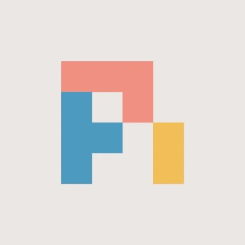
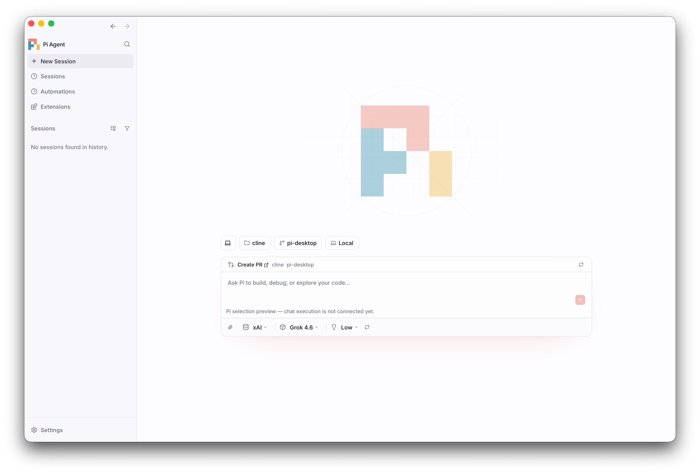

<p align="center">
  
</p>

<h1 align="center">Pi Desktop</h1>

<p align="center">
  A native desktop home for Pi Agent.<br />
  Your Pi configuration. Your models. A workspace of your own.
</p>

<p align="center">
  <a href="#run-locally">Run locally</a> ·
  <a href="apps/examples/desktop-app/README.md">Development guide</a> ·
  <a href="https://github.com/KayanoLiam/pi-desktop/issues">Issues</a>
</p>



> **Early preview — chat runs through your installed Pi CLI.**
> New local threads execute through `pi --mode rpc`: streaming answers,
> thinking, tool calls, approvals, cancellation, Pi session history and Pi's
> slash commands. This is an independent desktop project, currently being
> migrated from Cline; parts of the tree are still inherited Cline code.

## What works today

- **A native window.** Tauri 2 wraps a Next.js interface and a Bun backend. The app opens as **Pi**, not a browser tab.
- **Chat through Pi.** Each active thread is a `pi --mode rpc` process started from the thread's workspace with the picked provider, model and thinking level. Assistant text and thinking stream live; `bash`, `read`, `edit`, `write`, `grep` and extension tools show as tool cards with live output; token usage and cost come from Pi.
- **Tool approvals, opt-in.** Tools run without asking by default, like the Pi CLI. Flip the composer's shield to **Ask first** and every tool call waits for your approval; the switch works mid-session.
- **Extension dialogs.** When an installed Pi extension asks a question (`select`, `input`, `confirm`, `editor`), it appears as a question card in the chat; notifications land in the transcript log.
- **Stop, queue, steer.** Stop a running turn; messages sent while Pi is busy queue as follow-ups.
- **Pi session history.** Sessions from `~/.pi/agent/sessions` appear in the sidebar with the **Pi** source label. Open one to read it, continue it (Pi is relaunched on that session file), rename or delete it; the same sessions show up in `pi /resume`.
- **Pi's slash commands.** Typing `/` lists the extension commands, prompt templates and skills your installed Pi offers for that workspace. Installing or removing Pi packages in a terminal refreshes the list and the model picker automatically.
- **Your configured Pi models.** Browse providers and models from your local Pi configuration, filtered by `enabledModels`, rather than an unfiltered built-in catalog.
- **Selections that stay with you.** Each provider remembers its model; each provider/model pair remembers its thinking level. Pi startup defaults seed the picker when no desktop selection is saved.
- **Model-aware thinking controls.** Available levels come from model capabilities. Unknown extension capabilities are not guessed.
- **Light and dark themes.** Saved preferences and system appearance are respected, with a coral accent and the Pi mark throughout the app.
- **A local-first entry screen.** Choose a workspace and see its branch without Cline onboarding or an account sign-in. Cline Cloud is disabled.

Not yet: forking or editing earlier messages of a Pi thread, editing or removing a single queued message, file checkpoints, and SSH remote threads (those still run on the inherited Cline runtime). Sidebar entries such as **Automations** and **Extensions** are inherited UI surfaces, not Pi features.

## Run locally

### Requirements

- **Bun 1.3.13** and **Node.js 22 or newer**. Use Bun for dependency installation and scripts.
- A current stable **Rust** toolchain. The dependency graph requires Rust 1.85 or newer; the complete minimum-version matrix has not been verified.
- The [Tauri platform prerequisites](https://v2.tauri.app/start/prerequisites/), including Xcode Command Line Tools on macOS.
- An installed [`pi`](https://github.com/earendil-works/pi) CLI on your `PATH` (or `PI_DESKTOP_PI_BIN` pointing at it) with a configured `~/.pi/agent`. Pi runs the chat; the desktop only drives it.

```sh
cd ~/Desktop
git clone https://github.com/KayanoLiam/pi-desktop.git
cd pi-desktop

bun install --frozen-lockfile
bun run build:sdk

cd apps/examples/desktop-app
bun run dev
```

This launches the **native Tauri app**. Its development webview uses port `3125`; the sidecar uses `3126`. Stop conflicting desktop/headless development processes first. The first launch builds native dependencies, the sidecar, and SSH helpers, and may download build tools.

For browser-only debugging, use `bun run dev:headless` from the app directory. It does **not** open a native window. An older installed Cline app does not reflect this checkout.

macOS is the currently exercised native development platform. Inherited Windows/Linux packaging scripts are not a verified Pi Desktop release matrix. Use the source workflow above; signing, updater endpoints, and standalone distribution still need migration.

## Bring your Pi configuration

The catalog reads `~/.pi/agent`, or the directory selected by `PI_CODING_AGENT_DIR`:

| File | Used for |
| --- | --- |
| `auth.json` | Locally configured provider credentials and availability |
| `models.json` | Custom providers and models |
| `models-store.json` | Cached provider model metadata |
| `settings.json` | `enabledModels`, startup defaults, and thinking preferences |

Configure providers in Pi, then use the picker’s refresh control to reload. Model identity always includes **both provider ID and model ID**, so identical model names from different providers do not share a selection. A listed credential does not prove that a future model request will succeed.

### How execution works, and what runs your code

Every active thread is a real `pi --mode rpc` process (the user's installed Pi, not a bundled copy), started in the thread's workspace with `--session-id`/`--session`, `--model provider/id`, `--thinking level` and one extra extension. It loads **your** Pi extensions, packages, credentials and settings, exactly like the terminal. That means:

- Extension code, tools and MCP servers configured in Pi run with your user's full permissions. Nothing here is a sandbox.
- RPC mode never shows Pi's project-trust prompt; project-local `.pi` resources follow Pi's saved trust decisions and `defaultProjectTrust`. The desktop does not pass `--approve`.
- The extra extension is a generated tool-approval gate written to `~/.cline/data/pi-desktop/extensions/`. It hooks `tool_call` and asks the desktop before each tool runs; with auto-approve on (the default) the desktop answers yes immediately.
- Idle Pi processes exit after ten minutes and are relaunched on the thread's session file when you send again.

The model picker's catalog path is read-only (no credential refresh, no config writes, no API-key commands, no inference). Providers registered by installed Pi extensions are discovered by launching `pi` in RPC mode with `PI_OFFLINE=1`, no session and no tools; if Pi is unavailable, exact authenticated references stay visible with unknown thinking capabilities and nothing is invented.

## Architecture and migration

```text
Tauri native shell
        │
Next.js / React webview
        │  local transport
Bun sidecar
        ├── Pi threads: one `pi --mode rpc` process per active session
        ├── Pi session files (~/.pi/agent/sessions) for history
        ├── Pi configuration and model catalog
        └── Inherited Cline runtime (existing Cline sessions, SSH environments)
```

The goal is a standalone Pi desktop app. **This checkout is not standalone yet:** it retains the Cline monorepo and directly depends on `@cline/core`, `@cline/llms`, `@cline/shared`, and `@cline/ui`. Copying only the desktop directory will not produce a buildable project.

| Path | Purpose |
| --- | --- |
| [`apps/examples/desktop-app/`](apps/examples/desktop-app/) | Native app, webview, sidecar, and desktop development guide |
| [`sdk/packages/`](sdk/packages/) | Shared workspace dependencies still required by the desktop |
| [`docs/images/`](docs/images/) | Screenshots used by this README |
| Other `apps/` directories | Retained upstream projects; not the focus of Pi Desktop |

Existing Cline sessions and SSH environments retain their legacy execution paths. Removing Cline account screens does not remove those runtime dependencies. Bundle identifiers and updater configuration also still contain Cline values; they must be migrated before distributing an independent release.

### Next milestones

- Fork, message editing and per-item queue editing for Pi threads; SSH remote threads through Pi.
- Replace or extract the remaining Cline workspace/runtime dependencies.
- Migrate application identifiers, updates, signing, and release automation.
- Resolve inherited test/type/lint failures and establish desktop CI across supported platforms.

## Development

See the [desktop development guide](apps/examples/desktop-app/README.md) for commands, verification notes, native assets, and inherited runtime details. After SDK changes, rebuild with `bun run build:sdk` before testing or restarting the desktop: workspace packages resolve compiled `dist/` output.

The current baseline is **not all green**. A successful web build is not a passing webview typecheck, and inherited GitHub workflows are not evidence of Pi Desktop compatibility. Please include exact commands and results when reporting a bug or contributing a change.

## Acknowledgments and license

Pi Desktop builds on the [Cline](https://github.com/cline/cline) desktop architecture and the Pi coding-agent packages. Existing upstream code and copyright notices are retained.

This repository is licensed under [Apache 2.0](LICENSE). Original Cline code © 2026 Cline Bot Inc. Dependencies remain under their respective licenses.
